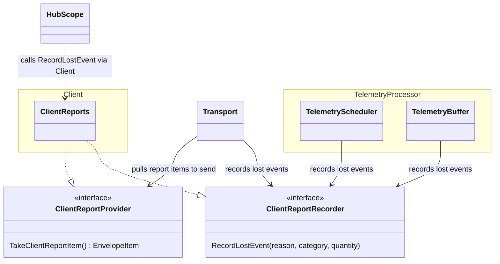
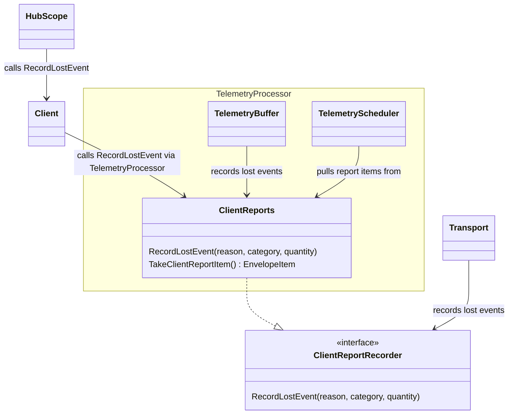

# Client Reports: Proposed Architecture Change

## Problem with the Current Approach

The current PR uses a **global registry keyed by DSN** to share a client reports Aggregator across Client, Transport, and Scheduler:

- **Global mutable state**: A package-level registry with DSN-keyed lookups is hard to reason about, test, and debug.
- **Implicit coupling**: Components fetch the Aggregator via `report.GetAggregator(dsn)` — no explicit dependency, just a shared global.
- **Two sending paths**: Both the classic Transport and the TelemetryProcessor have their own 30s ticker and envelope-attachment logic for client reports, duplicating behavior.

## Proposed Approach

### Core idea

The **Client owns client reports** during migration. Long-term, the **TelemetryProcessor owns client reports** once all telemetry data flows through it. The Client creates a single client reports instance and passes it to components that need it. No global registry.

### Two interfaces, one instance

**`ClientReportRecorder`** — for recording drops (used by many components):

```
RecordLostEvent(reason, category, quantity)
```

**`ClientReportProvider`** — for sending reports (used by exactly one component at a time):

```
TakeClientReportItem() → EnvelopeItem (or nil)
```

`TakeClientReportItem()` atomically drains all accumulated outcomes into an envelope item. The caller can attach it to an outgoing envelope (piggybacking) or send it as a standalone envelope on a timer.

### During migration

**Migration phase** = not all telemetry data flows through the TelemetryProcessor yet. Either the SDK has no TelemetryProcessor at all, or it only handles some categories (e.g. logs/metrics) while others (errors, transactions) still go through the classic Transport.

During this phase, the Client owns client reports. The existing sending mechanism (e.g. Transport) keeps sending reports unchanged. TelemetryProcessor only records drops.



### After full migration

TelemetryProcessor owns client reports. TelemetryScheduler handles sending. Transport sending logic removed.



### Sending: one path at a time

**Do not add client report sending logic to the TelemetryProcessor until all telemetry data flows through it.** Keep the existing sending mechanism as-is during migration. Only once fully migrated, move sending to the TelemetryScheduler and remove it from the previous location.

Exactly one component holds `ClientReportProvider` at any point in time:

| Phase | Who has `ClientReportProvider` |
|-------|-------------------------------|
| No TelemetryProcessor | Existing mechanism (e.g. Transport) |
| Partial TP (logs/metrics only) | Existing mechanism (unchanged) |
| Full TP (all telemetry) | TelemetryScheduler (previous sending logic removed) |

Recording drops is identical in every phase — same instance, same `ClientReportRecorder` interface.

### Pros

- No global state, no DSN-keyed registry — one instance per Client, DSN scoping implicit.
- Two focused interfaces: components only see what they need; all internals stay private.
- Exactly one component sends client reports at any time — no duplicate logic.
- Works with or without TelemetryProcessor — clean migration path.
- Survives the Hub → Scope refactoring (Client is the stable layer).

### Cons

- The existing sending mechanism needs to receive the `ClientReportProvider` interface (small change).
